# CSS and JavaScript Clocks
|  Preview   | Source Code  |
|  ----  | ----  |
|   | [https://codepen.io/amirrezajef/pen/NEoJKd](https://codepen.io/amirrezajef/pen/NEoJKd) |
|   | [https://codepen.io/jkantner/pen/KQaZdp](https://codepen.io/jkantner/pen/KQaZdp) |
|   | [https://codepen.io/ge1doot/pen/EaOxvR](https://codepen.io/ge1doot/pen/EaOxvR) |
|   | [https://codepen.io/astuteape/pen/QXQZmM](https://codepen.io/astuteape/pen/QXQZmM) |
|   | [https://codepen.io/museum404/pen/FsGtu](https://codepen.io/museum404/pen/FsGtu) |
| 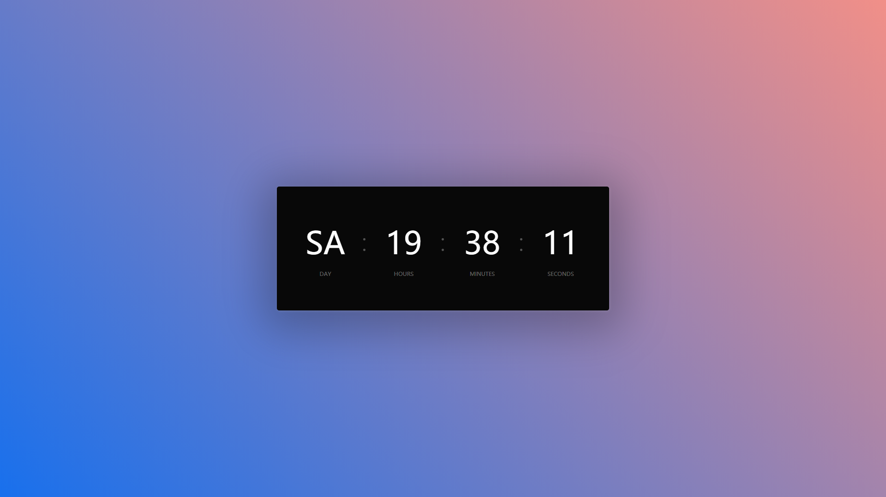  | [https://codepen.io/eehayman/pen/jVPKpN](https://codepen.io/eehayman/pen/jVPKpN) |
| 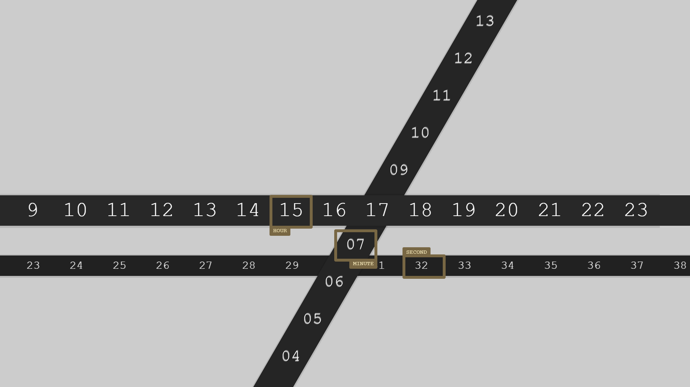  | [https://codepen.io/mikehobizal/pen/RNjREN](https://codepen.io/mikehobizal/pen/RNjREN) |
| 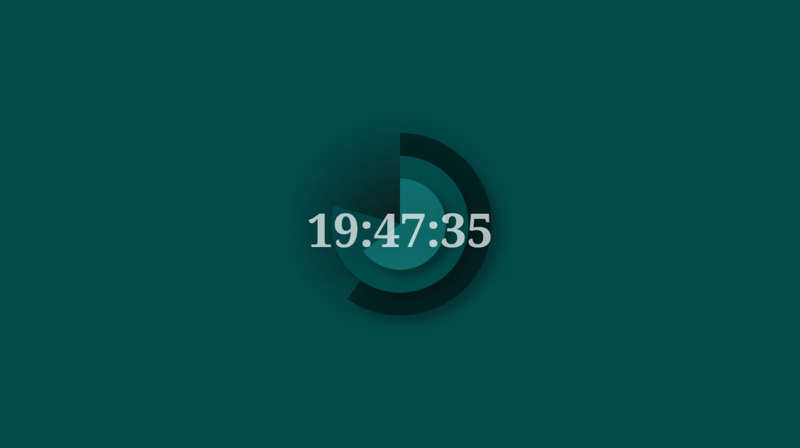  | [https://codepen.io/tmrDevelops/pen/VYKyge](https://codepen.io/tmrDevelops/pen/VYKyge) |
| 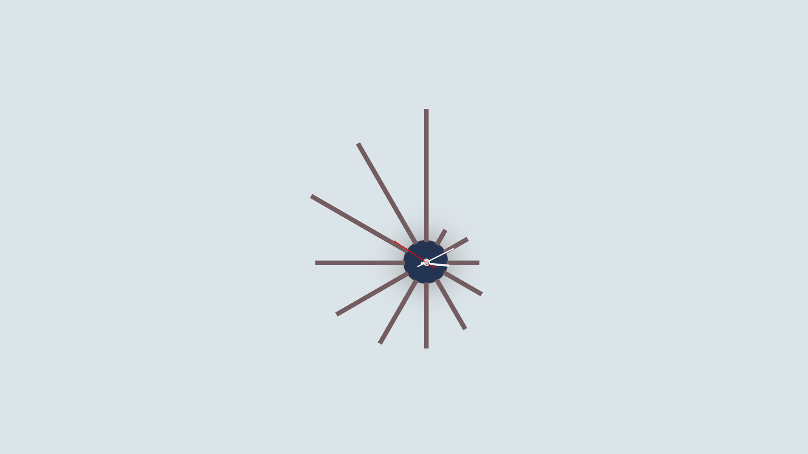  | [https://codepen.io/Zuzana/pen/mMbzvY](https://codepen.io/Zuzana/pen/mMbzvY) |
| 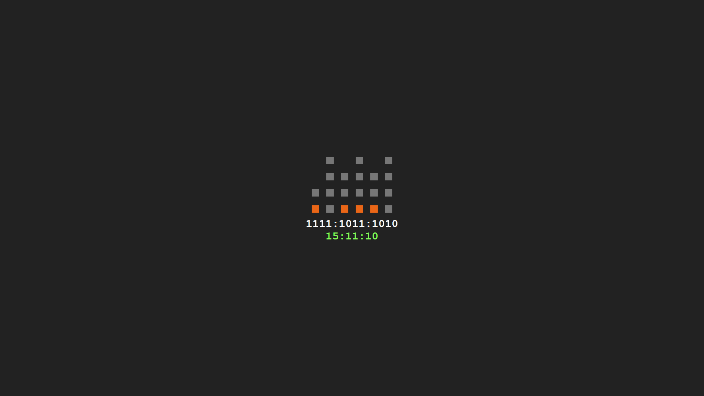  | [https://codepen.io/Hammertime38/pen/crtEg](https://codepen.io/Hammertime38/pen/crtEg) |
| 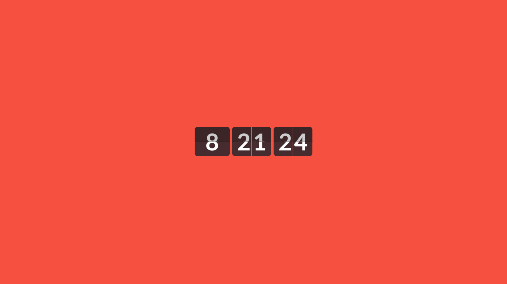  | [https://codepen.io/paulnoble/pen/NqxdLm](https://codepen.io/paulnoble/pen/NqxdLm) |
| 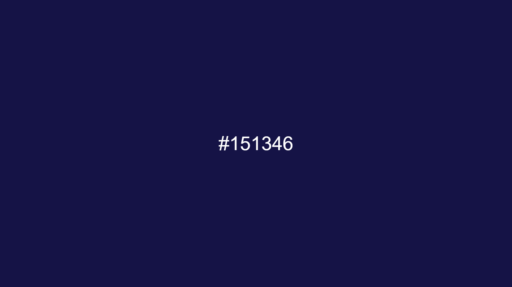  | [http://www.jacopocolo.com/hexclock/](http://www.jacopocolo.com/hexclock/) |
| 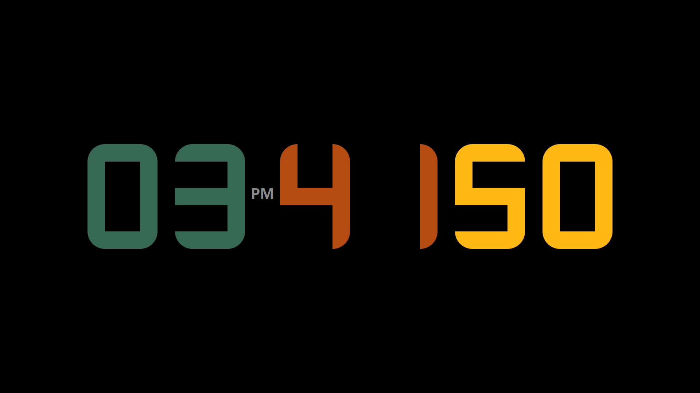  | [https://codepen.io/marcosmou/pen/qNPYzb](https://codepen.io/marcosmou/pen/qNPYzb) |
|   | [https://codepen.io/andysteaua/pen/FtEIK](https://codepen.io/andysteaua/pen/FtEIK) |
|   | [https://codepen.io/aamirafridi/pen/wgoiC](https://codepen.io/aamirafridi/pen/wgoiC) |
| 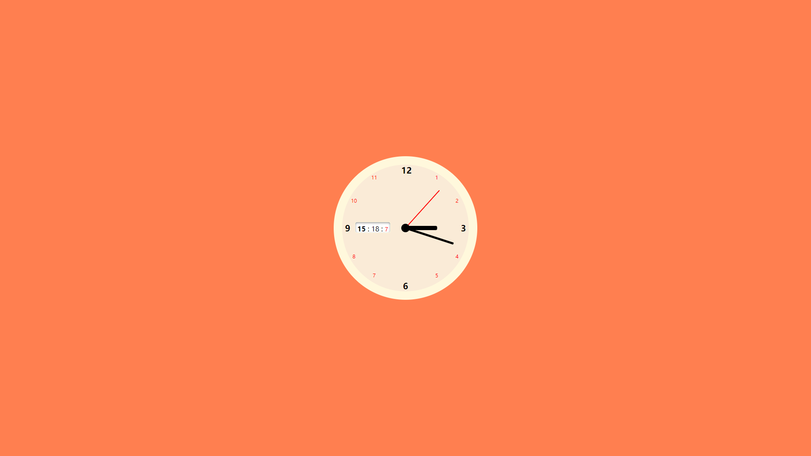  | [https://codepen.io/ahmadbassamemran/pen/WdKQyx](https://codepen.io/ahmadbassamemran/pen/WdKQyx) |
| 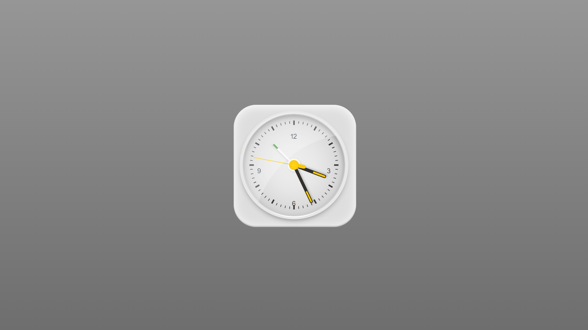  | [https://codepen.io/chrisota/pen/LERyjb](https://codepen.io/chrisota/pen/LERyjb) |
|   | [https://codepen.io/nilsynils/pen/EZzyVB](https://codepen.io/nilsynils/pen/EZzyVB) |
|   | [https://codepen.io/Wujek_Greg/pen/KRXYpg](https://codepen.io/Wujek_Greg/pen/KRXYpg) |
| 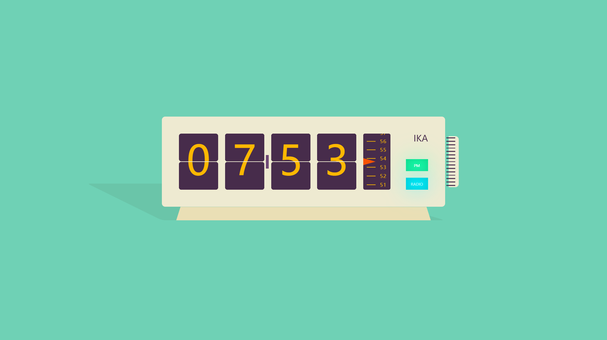  | [https://codepen.io/tstoik/pen/gaawRR](https://codepen.io/tstoik/pen/gaawRR) |
| 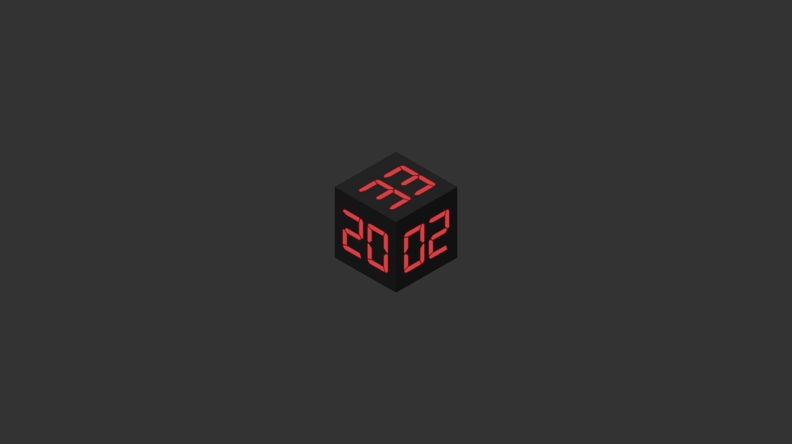  | [https://codepen.io/stix/pen/mVXypr](https://codepen.io/stix/pen/mVXypr) |
